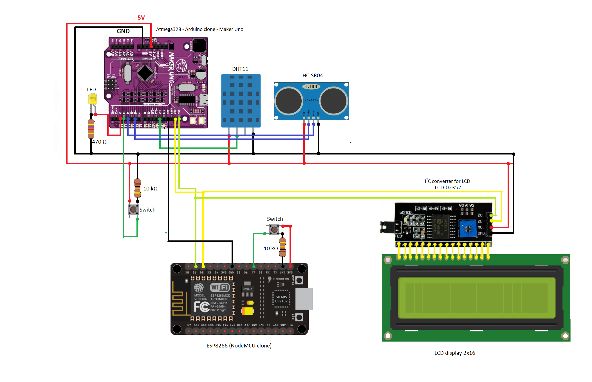
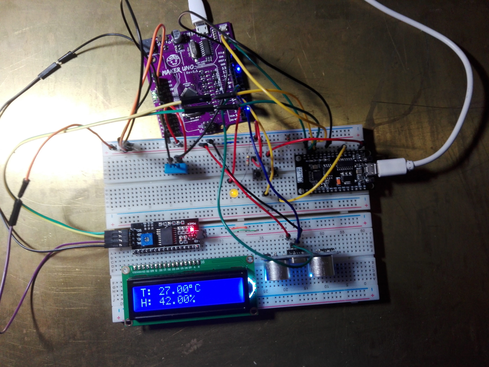

# SmartHome
| Angular7 | NodeJS | Arduino |
|--|--|--|

**SmartHome**  is a web application that was created to display current temperature and humidity in house. 

# How it works
  
  Arduino Uno connected with esp8266 in master-slave relation sending data to API. API stores data in data base and angular app make request via HTTP protocol to get data and display it in chart or table form.
  
### Chart example
  
  
  
### Table example
 
 
 Application provides alarms after logginig in. If we turn on alarm arduino gets armed and after getting closer to device it will alarm. Alarms status is shown in navbar and depends on status it is green  or red.

  

##About API avaible here

https://sleepy-garden-23787.herokuapp.com

##About Arduino

### Arduino scheme

### Photo

## About Angular

Application was written in Agular 7. It uses HTTP protocol to communicate with API. Application make **GET** request to obtain data and store it. Then after choosing date it seperate the appropriate one and then put it in HTML code via string interpolation. 

To arm the alarm, user needs to loggin. After loggin API returns token which is used to make **PUT** request and update status of alarm.  Received token is put in the header of request. On success boolean flag is changing status and view in browser updates.

  
Application uses open source **ChartJS** to display data in chart form.

 
#### Angular app available here 
https://dkrakowczyk.github.io/smartHome/
## Security
API uses JWT (JSON Web Token) authentication to secure from unwelcome requests.
 

## Authors
[Mateusz Wolski - Angular app](https://github.com/matewol540)
[Dawid Krakowczyk - NodeJS API](https://github.com/DKrakowczyk)
[Konrad Wasiak - Arduino device](https://github.com/KonradWasiak)
